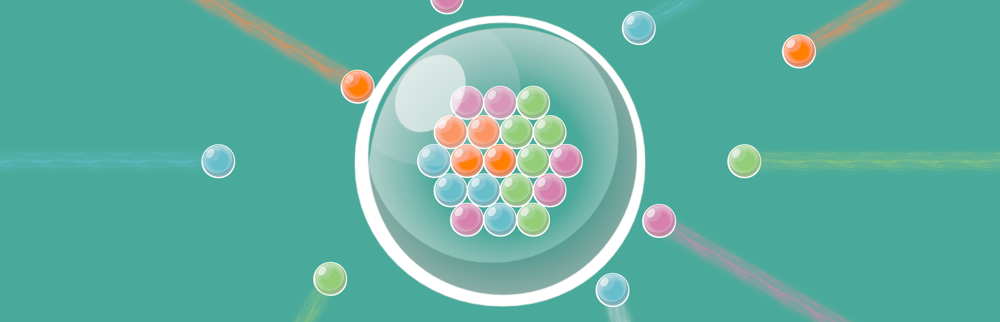

# Bubble Up! Website

## Introduction


Welcome to [Bubble UP! official website](<(https://www.bubbleupgame.com/)>).

Bubble UP! is an exciting game that will soon be released on Steam. [Wishlist Now](https://store.steampowered.com/app/3655340/Bubble_UP/).



## Installation Instructions

1. Clone the repository:

   ```bash
   git clone https://github.com/e-choness/bubble-up-website.git
   ```

2. Navigate to the project directory:

   ```bash
   cd bubble-up-website
   ```

3. Open the `index.html` file in your browser to view the website locally.

## Deployment Instructions

To deploy the website, follow these steps:

1. Ensure you have a GitHub Pages setup.
2. Push the latest changes to the `main` branch of your repository.
3. Enable GitHub Pages in the repository settings and set the source to the `main` branch.

## Copyright and License

© Bubble UP! 2025. All rights reserved. Website under the [CCA3.0](LICENSE.txt) license.

## Contributing

We welcome contributions! Please follow these steps:

1. Fork the repository.
2. Create a new branch for your feature or bug fix.
3. Submit a pull request with a detailed description of your changes.

## Contact

For inquiries, please email us at [bubbleup@bubbleupgame.com](mailto:bubbleup@bubbleupgame.com) or visit our [contact page](https://www.bubbleupgame.com/).
